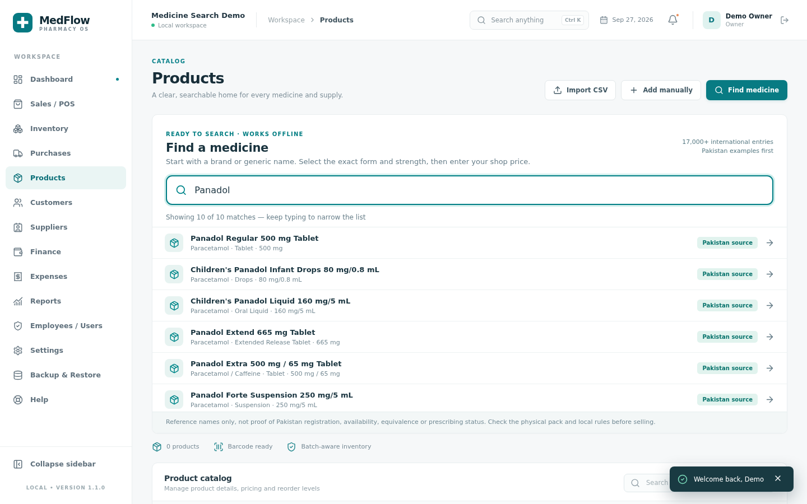
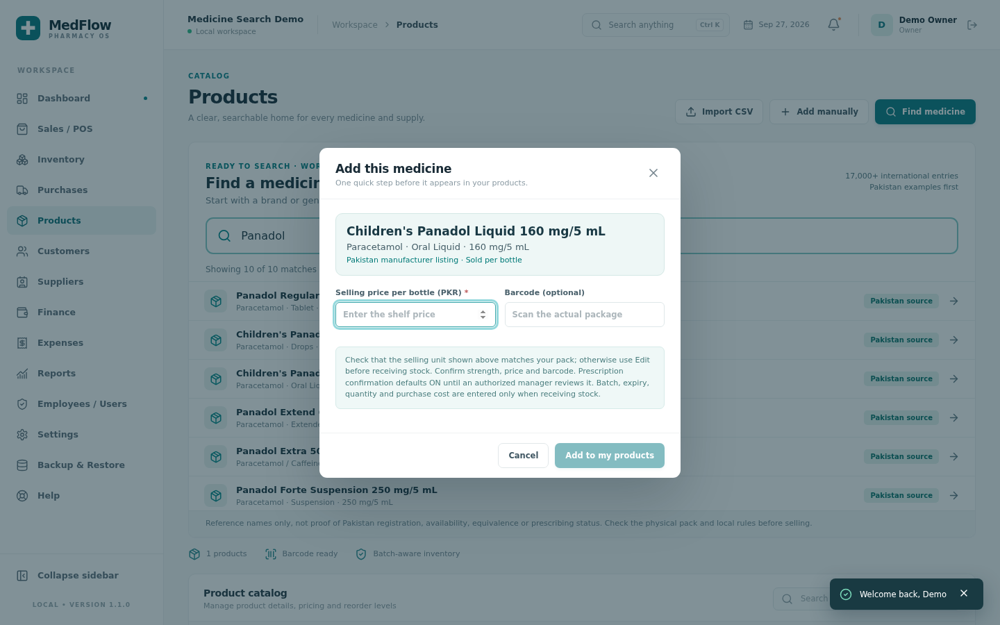

# Offline medicine lookup — coverage and safety

**Status:** Bundled with v1.1.0 Windows installers. The core workflow was signed off on Windows 10 for v1.0.0; this new version has not been independently retested through that entire workflow on Windows.

## What is bundled

- **Six Pakistan-market Panadol forms/strengths** manually curated from Haleon Pakistan product information. These are *examples*, not a complete Pakistan catalogue. Source: [Haleon's Pakistan Panadol product range](https://www.haleon.pk/our-brands/panadol/) and specific [children's](https://www.haleonhealthpartner.com/en-pk/pain-relief/brands/panadol/products/children/), [Extra](https://www.haleonhealthpartner.com/en-pk/pain-relief/brands/panadol/products/extra/), and [Extend](https://www.haleonhealthpartner.com/en-pk/pain-relief/brands/panadol/products/extend/) product pages. Brand names are identification facts only; product images and marketing copy are not redistributed.
- **17,378 current NLM RxTerms SCD/SBD names** from the September 2026 [RxTerms download](https://lhncbc.nlm.nih.gov/MOR/RxTerms/) (archive SHA-256 `c7aefff1974144b7a43f38f43d7a034b5b39d1339e53635ff90a94ea555965f2`). RxTerms describes itself as free to use and derived from non-proprietary RxNorm content. Only current, non-suppressed SCD/SBD names, ingredients, strengths and dosage forms were transformed; its identifiers are retained. The [rebuild script](../scripts/build-medicine-catalog.py) records the source URL and expected hash. The archive was not copied in full. Attribution: U.S. National Library of Medicine, Lister Hill National Center for Biomedical Communications, *RxTerms*, September 2026.

The [Data.gov entry](https://catalog.data.gov/dataset/rxterms) lists an ODbL database licence; this bundled data is not placed under MedFlow's all-rights-reserved *software* licence. Refer to NLM and the Data.gov record for data-reuse terms.

The Pakistan entries are ranked first, and all international matches are explicitly labeled **International / US**. RxTerms reflects U.S. prescribing terminology and is **not** a list of drugs approved, legally registered, sold, or equivalently formulated in Pakistan. The public DRAP search is useful for separate verification but has **not** been scraped or repackaged; bulk redistribution permission has not been established. Do not bundle scraped pharmacy prices or unlabeled synthetic drug lists.

## How staff use it

1. Open Products → **Find a medicine**. Search a brand, ingredient, form or strength. One-letter searches may produce thousands of matches, so 40 are displayed at a time; choose **Show more** or type more to narrow the result.
2. Choose the exact product **on the physical pack**. The short form only asks for a positive local selling price and an optional barcode taken from the pack. The shop must check its sale unit (tablet, bottle, etc.) in Edit before receiving stock. 
3. The new product enters the shop database with **zero stock**; no batch, quantity or expiry is created. Receipt in Purchases still requires batch number, actual expiry, quantity and cost. Existing shop records are preserved by updates.
4. The prescription-required flag defaults **on** until an authorized user checks the applicable local rule and deliberately edits the product. A dictionary suggestion alone must never authorize dispensing or replace a pharmacist's judgment.
5. If no entry matches, use **Add manually**, a short name/form/strength/price form with an advanced section. Existing CSV product import remains available. The store should verify its own barcode, pack size, price, registration and strength independently.

**Not complete worldwide.** New products, changing brands, salts, concentrations and regulatory status require a reviewed updated catalogue or a locally entered item. Price, batch, expiry, pack size and barcode cannot be safely inferred from the name alone. This feature is for inventory *data entry*, not diagnosis, dosing, substitutions or treatment advice. Core stock transactions remain offline and auditable.
