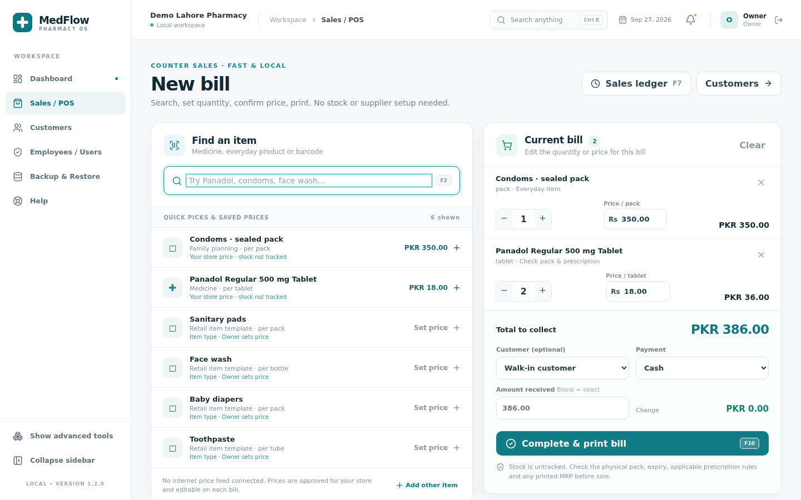

# MedFlow quick counter — v1.2.0 development preview

**Not released as a Windows installer yet.** [v1.1.0 remains the latest published release](https://github.com/haseebkhokhar020/medflow/releases/latest). This page describes the working source preview, not the already-published installer.

## One-minute start

1. On a fresh store, enter a shop name (optional) and create a private **6–10 digit Owner PIN**. It is hashed in the local SQLite database; five incorrect attempts temporarily block login for 15 minutes. This replaces the five-page first-run wizard for new stores. Existing stores retain their original owner accounts and passwords and are not reset.
2. Sales / POS is the default screen. Search by name or barcode; suggestions include medicines, 56 generic retail product *types*, and the store's saved items. Suggestions **do not contain verified Pakistani retail prices**.
3. On first use, the **Owner approves a price for the exact selling unit** (for example, *one tablet*, *one bottle*, or *one sealed pack*). An unpriced item **cannot be billed**. Custom brand, pack and size can be entered in **Add other item**. Search will prefill the saved price the next time. A cashier can change the price on one bill without changing the default; the change is audited.
4. Set quantity, optionally select a customer, collect full payment and print or save the bill as a PDF. Cash and other payment methods are recorded. The new sales ledger shows bills and refunds. Partial/credit payments remain in Advanced → Batch sales rather than this cash-style counter.
5. If desired, use **Show advanced tools** for managed stock, FEFO batch sales, purchases, suppliers, reports and backups. Batch sales remain separate so a tracked medicine **cannot bypass expiry or available-stock checks** using the fast counter. Both workflows' revenue and returns are included in the overview and sales reports; profit is explicitly **unknown** when untracked sales have unknown purchase cost.

## Data and pricing limits

- The data bundled at this stage is **six** Pakistan Panadol identification examples, **17,378** U.S. RxTerms medicinal terms, plus **56 generic retail-item type templates** (condoms, pregnancy tests, skincare, toiletries, baby products, hygiene and medical supplies). The 56 are intentionally **not fabricated named Pakistani brands, barcodes, specific pack sizes or prices**. Enter missing local items as they are sold; the system then remembers them. More than 17,000 international drug terminology records are not evidence of Pakistan availability or registration.
- There is **no verified, authorized nationwide Pakistani medicine-and-general-retail price feed** available to this project. Neither regulated maximum retail price nor shop-specific selling price can be reliably inferred from a generic medicine name or a different unit/pack. Online updates are therefore **not implemented**: pretending otherwise would put wrong amounts on real bills. To support automatic updates later, the Owner would need an authorized supplier/API/CSV feed with product identity, exact unit and pack size, locality/validity dates, reuse permission, and change-review rules.
- Prices must be verified against the actual pack and applicable local law, including any printed maximum retail price. MedFlow does not certify drug registration, give medical advice, or know whether a product is prescription-only in Pakistan. Medicine quick sales ask staff to confirm a pack/expiry and applicable prescription check because **no batch was recorded**. This confirmation is not an automated expiry check.
- The simple ledger takes payment in full; printed receipts and refund records are generated locally. Inventory-free sales **do not** create stock or cost-of-goods figures. Keep regular backups; storage is local. For a tracked product with any batches, use Advanced → Batch sales, not the untracked checkout.

## Current verification

Source-level tests exercise PIN throttling, Owner-only pricing, rejected unpriced sales, medicine checks, overrides, refunds, reports, historical price snapshots and tracked-stock protection. The existing FEFO workflow tests still pass. The quick setup → search → price → bill → ledger interface was exercised in a headless browser using fictional demo data. **No v1.2.0 Windows installer has been released or fully device-tested.**
